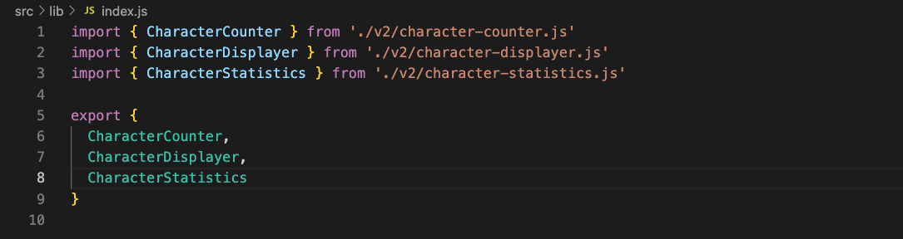

# Reflections on Clean Code

## Kapitel 2: Meaningful Names

Kapitel 2 har påverkat mig på det sättet att jag har gjort justeringar på namn i både utveckling av applikationen och modulen. Min modul som först hette `Sign Analysis Module ` har fått det nya namnet `Character Analysis Module`. Ordvalet "sign" har helt och hållet bytts ut mot "character" då sign har en mer diffus betydelse och kan tolkas på olika sätt. Det nya namnet ger en mer tydlighet i vad modulen och applikatioen ska utföra, det har en starkare koppling till just tecken i en text som applikationen och modulen ska analysera. I princip är detta vad hela kapitel 2 handlar om, att namn ska vara tydliga och meningsfulla, men framförallt berör detta avsnittet om att namn ska vara avslöjande (intention-revealing). Inga namn ska behöva förklaras, de ska vara självförklarande. 

## Kapitel 3: Functions

## Kapitel 4: Comments

Tidigare har jag ofta velat kommentera varje klass, funktion eller klass med en beskrivande kommentar, även om jag själv inte tyckt det medfört något utöver det uppenbara (något som blivit för att inte få lintningsfel(Mandated Comments)). Under denna laboration har jag valt att ta bort i princip alla kommentarer. Just för att gå tillbaka och reflektera om det verkligen behövs eller inte. I många fall har en förklarande namngivning och kort funktion gjort att en kommentar blir överflödig (Redundant). Jag tycker det däremot är svårt att ge djupare innebörd med hjälp av kommentarer, det är svårt att kommentera vad syftet med en funktion är eller hur den ska användas.

I övrigt tycker jag det är bra med kommentarer, jag gillar tydlighet och det tycker jag kommentarer medför. Men då är det på villkoret att kommentarerna är organiserade och har en tydlig struktur.

Scary Noise
Commented-Out Code 

## Kapitel 5: Formatting

## Kapitel 6: Objects and Data Structures

## Kapitel 7: Error Handling

Error handling var något jag helt missade i min förra inlämning av modul. Något jag nu ändrat på och har applicerat i modulen för att kunna hantera eventuella fel som kan uppstå. Varje klass kastar ett undantag som fångas upp i try-catch block. I catch blocket fångas undantaget upp och skickas vidare till en funktion som skriver ut ett felmeddelande till användaren. Däremot är det inte några större fel som kan uppstå i modulen vilket gjorde applicering av error hantering ganska enkelt.

## Kapitel 8: Boundaries

## Kapitel 9: Unit Tests

## Kapitel 10: Classes

## Kapitel 11: Systems