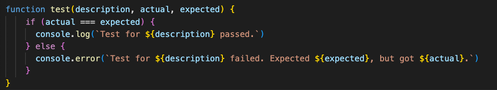
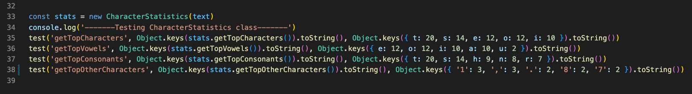

# Reflections on Clean Code

Inledningsvis vill jag börja med en egen reflektering över applicering av Clean Clode till detta projekt. Jag tycker själv att färdigställa (utefter Clean Codes riktlinjer) redan skriven kod är en utmaning. Främsta utmaningen är att hitta och sedan optimera redan färdiga lösningar till det bättre. Klart att det är nyttigt och lärorikt med dessa utmaningar, men det blir även en utmaning att känna sig nöjd. Det som leveras mot en deadline kanske inte är det optimala man önskat. Vilket känns frustrerande men som samtidigt får mig att vilja utvecklas och bli en bättre strategisk utvecklare.

## Kapitel 2: Meaningful Names

Kapitel 2 har påverkat mig på det sättet att jag har gjort justeringar på namn i både utveckling av applikationen och modulen. Min modul som först hette `Sign Analysis Module ` har fått det nya namnet `Character Analysis Module`. Ordvalet "sign" har helt och hållet bytts ut mot "character" då sign har en mer diffus betydelse och kan tolkas på olika sätt. Det nya namnet ger en mer tydlighet i vad modulen och applikatioen ska utföra, det har en starkare koppling till just tecken i en text som applikationen och modulen ska analysera. I princip är detta vad hela kapitel 2 handlar om, att namn ska vara tydliga och meningsfulla, men framförallt berör detta avsnittet om att namn ska vara avslöjande (intention-revealing). Inga namn ska behöva förklaras, de ska vara självförklarande. 

*Komponent med beskrivande namn i applikationen som använder sig av `character-analysis-module`.*

## Kapitel 3: Functions

Budskapet från kapitel 3 om att funktioner ska vara korta och även kortare än så är något jag burit med mig från laboration 2 och försökt bära med mig genom arbetet av både modul och applikation. Däremot är det vissa funktioner i min modul som längre än 20 rader, vilket är det rekommenderade maxantalet rader för en funktion. Dessa funktioner hade kunnats brytas ner till fler mindre funktioner då de gör mer än en sak. 

Däremot var det en utmaning med funktioner i test-appen ur ett annat perspektiv, kapitlet tar upp att idealet for antalet argument är noll. En funktion `test` tar tre argument för att validera att metoderna i modulen utför det som är förväntat, något som man skulle kunna modifiera. Funktionen i sig är däremot kort, vilket i sig är positivt.  

## Kapitel 4: Comments

I tidigare projekt har jag ofta känt att jag behövde kommentera varje klass, funktion eller kodblock med beskrivande kommentarer, även om de i själva verket inte tillförde något utöver det uppenbara. I vissa fall gjorde jag detta enbart för att undvika lintningsfel, där kommentarer krävdes som en standard.

Under den senaste laborationen har jag ändrat min praxis och valt att i princip ta bort alla dessa kommentarer. Jag gjorde detta för att ge mig själv utrymme att reflektera över om kommentarerna verkligen var nödvändiga eller överflödiga. Jag insåg att i många situationer kunde enklare och mer beskrivande namngivning av variabler och korta funktioner eliminera behovet av kommentarer.

Jag vill dock framhålla att jag inte är emot att kommentera kod i sig. Jag värdesätter tydlighet och ser att välplacerade kommentarer kan förbättra förståelsen av koden. Men jag har kommit att inse att kommentarer bör vara strukturerade och ha en tydlig syftet för att vara effektiva.

*Använder en radkommentar för att förklara vad regex-uttrycket gör.*

## Kapitel 5: Formatting

Varken modul eller applikation i detta projekt är några tyngdlyftare i densitet av kod. Den vertikala formatteringen är som mest på nästan 130 rader i modulen och drygt 60 rader i applikationen. Med hjälp av att tänka objektorienterat och dela upp koden i klasser har koden lyckats hålla sig relativt kort. Det bidrar även till att koden blir lättare att förstå. 

Horisontellt ligger stort fokus på indentering för att öka läsbarheten av koden. Detta är något jag värderar högt och applicerar i min kod. Personligen har jag svårt att läsa kod som inte är indenterad, det sätts som en spärr i huvudet mig (nästintill allergisk reaktion). Både i modulen och applikationen har jag valt att använda mig av 2 spaces för indentering.

Jag uppskattar det sistnämnda i kapitlet där Uncle Bob's Formatting Rules presenteras. Det är enkla regler som är lätta att applicera och som ger en tydlig struktur i koden. Varför? Jo, för att i exemplet är den vertikala densiteten lagom, den horisontella indenteringen är tydlig och det finns en tydlig struktur i koden.

*Exempel på formattering av en komponent i applikationen.*

## Kapitel 6: Objects and Data Structures

I kapitel 6 belyser boken vikten i objektorienterad programmering och hur man hanterar både object och datastrukturer. Detta är något jag har applicerat i modulen och applikationen. I modulen har jag valt att dela upp koden i klasser som hanterar olika delar av applikationen. 

Kapitlet tar även upp funktionsanrop och fenomenet train wreck. I och med att det var något jag själv hade som ämne under workshop 2 var det något jag försökt undvika men inte helt lyckats med. I modulens test-app förekommer train wreck, något som jag hade kunnat undvika genom att skapa variabler som håller funktionsanropen. Det hade gjort koden mer läsbar.

*Train wreck i test-appen.*

## Kapitel 7: Error Handling

Error handling var något jag helt missade i min förra inlämning av modul. Något jag nu ändrat på och har applicerat i modulen för att kunna hantera eventuella fel som kan uppstå. Varje klass kastar ett undantag som fångas upp i try-catch block. I catch blocket fångas undantaget upp och skickas vidare till en funktion som skriver ut ett felmeddelande till användaren. 

Liknande procedur har jag applicerat i applikationen där varje komponent som används i applikationen kastar ett undantag som fångas upp i en try-catch block. I catch blocket fångas undantaget upp och skickas vidare till en funktion som skriver ut ett felmeddelande till användaren. Det gör att kommunikationen med användaren blir tydligare och att användaren förstår vad som blev fel, vilket i sin tur bidrar till en trevligare användarupplevelse. Felhantering är dessutom minst lika viktigt för att kunna kommunicera mellan programmerare i utvecklingsmiljön.

*Exempel på hantering av fel i modulen.*

## Kapitel 8: Boundaries

I kapitel 8 lyfts vikten av att hantera och integrera extern kod till ett projekt. Precis som kapitlet tar upp öppnar det upp stora möjligheter till att utveckla ett projekt. Dock medför det att man inte har full kontroll över koden som integreras. Lösning blir att lära sig testa och förstå den externa koden. Lite så fick jag göra när jag integrerade Recharts till applikationen. Applikationen har Recharts används som ett tredjepartsbibliotek med dess inbyggda metoder för att ta fram ett grafiskt tabelldiagram. Modulen som även den är ett tredjepartsbibliotek interageras till applikationen genom ett npm paket. Skillnaden där är att jag har full kontroll över koden i modulen och kan göra ändringar i den.

## Kapitel 9: Unit Tests

Unit tests är ett viktigt verktyg för att kunna testa och verifiera att koden fungerar som den förväntas göra. I mitt projekt har jag använt manuella enhetstester, vilket har hjälpt mig att validera koden och öka förtroendet för dess funktionalitet. Att använda funktioner för att verifiera resultat har förenklat testprocessen. Jag har nu insett att att gå vidare till automatiserade enhetstester kan ytterligare förbättra testningen och identifiera fel tidigare i utvecklingscykeln, vilket kommer att vara ett värdefullt steg för att upprätthålla kodkvalitet

## Kapitel 10: Classes

Kapitel 10 tar upp vikten av att klasser ska vara små och ha ett tydligt syfte. Detta är något jag försökt applicera i både modul och applikation. I modulen har jag valt att dela upp klasserna med separata ansvarsområden. En klass hanterar att räkna tecken i en text, en klass hanterar att visa olika kategorier av tecken och en klass hanterar statistik för tecken. I och med att applikationen är skriven i React har jag valt att dela upp koden i olika komponenter som speglar klasserna från modulen. En komponent hanterar att visa räknade tecken ur en text, en komponent visar de olika tecken som finns i de olika kategorierna, en komponent hanterar att visa statistik för tecken och en komponent hanterar att visa ett diagram för statistiken. Komponenterna hade kunnat brytits ned till ännu mindre återanvändbara beståndsdelar. 

*TextAnalyzer komponenten som tar in andra komponenter.*

## Kapitel 11: Systems

När det gäller kapitel 11 "Systems", har jag inte tänkt på systemnivån i varken applikationen eller modulen. Projektet har inte krävt att jag överväger systemnivån eftersom det är relativt enkelt och inte involverar hantering av stora datamängder eller komplexa systemkomponenter. Om man i dagsläget skulle applicera någon form av systemnivå skulle man kunna jämföra modulen som en är uppbyggd med sina klasser som var och en hanterar sin sak för att göra modulen komplett och fungerande. 

Om projektet däremot skulle växa, vilket det finns ambitioner om i vidare utveckling, skulle det vara en god idé att organisera projektet i systemnivå där varje systemkomponent har ett tydligt syfte och ansvarsområde.

*Exempel på vad som skulle kunna utvecklas i systemnivå i modulen.*

