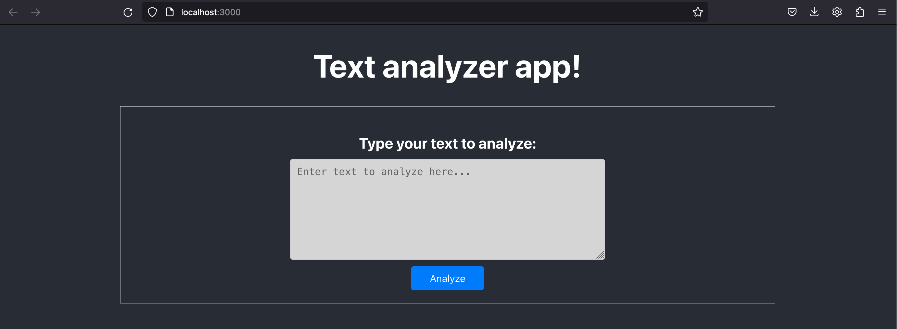
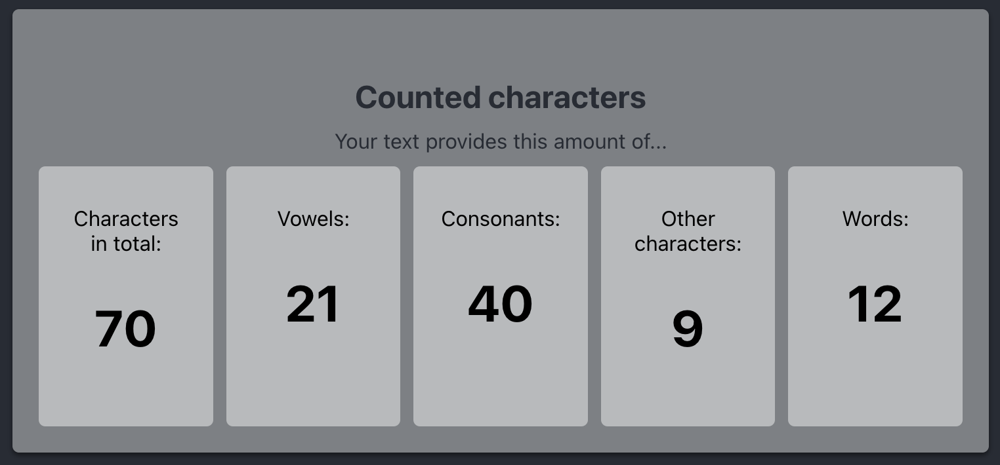
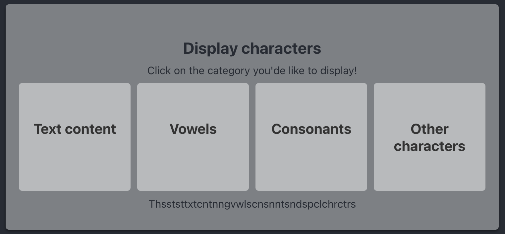
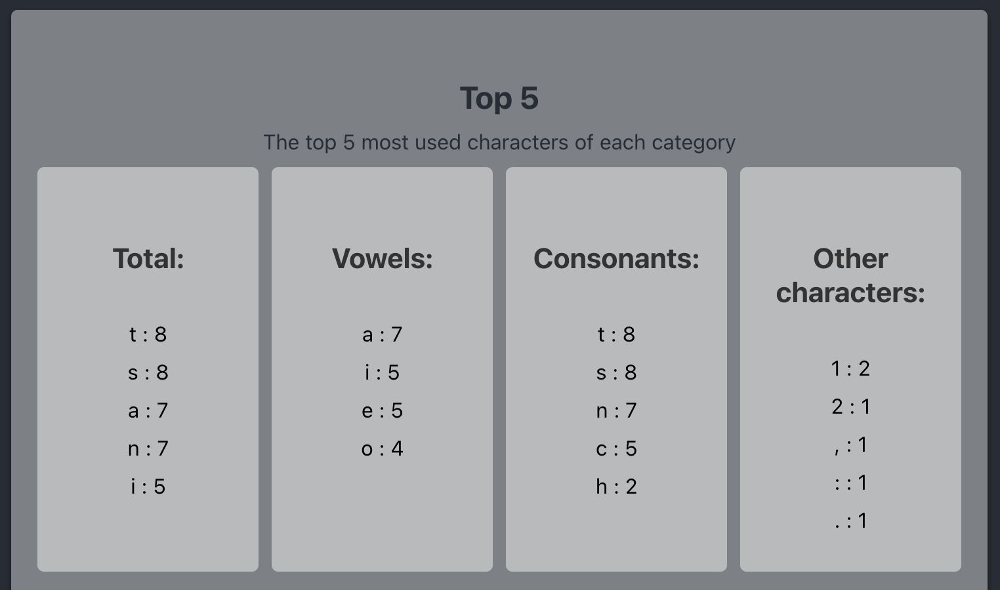
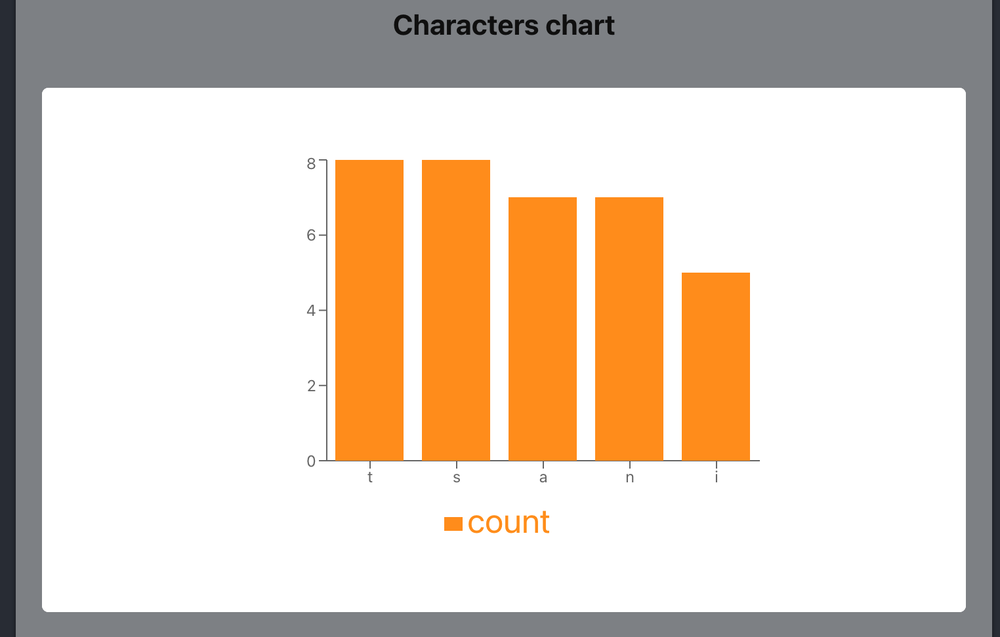
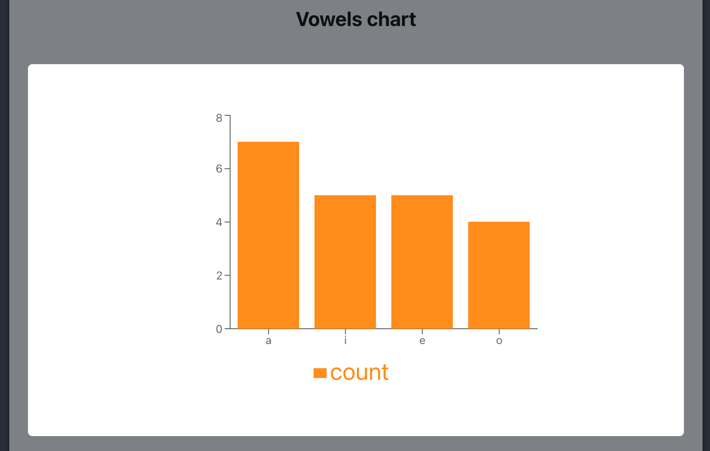
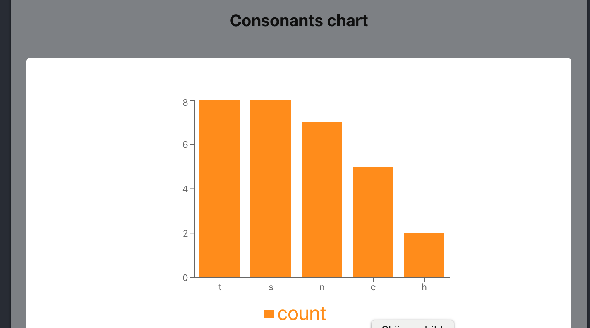

## Testfall

### 1.1 Webbapplikationen ska vara en webbapplikation.
1. Starta igång appen genom kommandot `npm start` i terminalen.
2. Gå till localhost:3000 i webbläsaren (om den inte öppnas automatiskt). 
3. Webbapplikationen ska vara en webbapplikation.

#### Testrapport

| ID | Krav | Testfall | Förväntat resultat | Utfall | Kommentar |
| --- | --- | --- | --- | --- | --- |
| 1 | Appen ska vara en webbapplikation. | 1.1 | Webbapplikationen ska öppnas i webbläsaren på localhost:3000. | Webbapplikationen öppnas i webbläsaren på localhost:3000 | Pass |

### 2.1 Webbapplikationen ska kunna ta emot input i form av text.
1. Skriv in text i textfältet med följande innehåll: "This is a test text containing vowels, consonants and special characters: 111223.".
2. Tryck på knappen "Analyze".

#### Testrapport

| ID | Krav | Testfall | Förväntat resultat | Utfall | Kommentar |
| --- | --- | --- | --- | --- | --- |
| 2 | Webbapplikationen ska hantera input i form av text. | 2.1 | Webbapplikationen ska ha ett textfält för att ta emot input text av slutanvändaren. När användaren trycker på en knapp ska appen hantera texten. | En textarea tar in input i form av text som hanteras när man trycker på Analyze. | Pass |

### 3.1 Webbapplikationen ska räkna antal tecken i texten.
1. Utför stegen i testfall 2.1.
2. Webbapplikationen ska räkna antal tecken i den angivna texten och visa resultatet.

#### Testrapport

| ID | Krav | Testfall | Förväntat resultat | Utfall | Kommentar |
| --- | --- | --- | --- | --- | --- |
| 3 | Webbapplikationen ska analysera texten genom att räkna tecken inom olika kategorier. | 3.1 | Webbapplikationen ska räkna antal tecken i texten. Webbapplikationen ska visa att det finns 70 tecken. | Characters in total: 70 | Pass |

### 3.2 Webbapplikationen ska räkna antal vokaler i texten.
1. Utför stegen i testfall 2.1.
2. Webbapplikationen ska räkna antal vokaler i den angivna texten och visa resultatet.

#### Testrapport

| ID | Krav | Testfall | Förväntat resultat | Utfall | Kommentar |
| --- | --- | --- | --- | --- | --- |
| 3 | Webbapplikationen ska analysera texten genom att räkna tecken inom olika kategorier. | 3.2 | Webbapplikationen ska räkna antal vokaler i texten. Webbapplikationen ska visa att det finns 21 vokaler. | Vowels: 21 | Pass |

### 3.3 Webbapplikationen ska räkna antal konsonanter i texten.
1. Utför stegen i testfall 2.1.
2. Webbapplikationen ska räkna antal konsonanter i den angivna texten och visa resultatet.

#### Testrapport

| ID | Krav | Testfall | Förväntat resultat | Utfall | Kommentar |
| --- | --- | --- | --- | --- | --- |
| 3 | Webbapplikationen ska analysera texten genom att räkna tecken inom olika kategorier. | 3.3 | Webbapplikationen ska räkna antal konsonanter i texten och visa att det finns 40 konsonanter. | Consonants: 40 | Pass |

### 3.4 Webbapplikationen ska räkna antal övriga tecken (till exempel siffror och skiljetecken) i texten.
1. Utför stegen i testfall 2.1.
2. Webbapplikationen ska räkna antal övriga tecken i den angivna texten och visa resultatet.

#### Testrapport

| ID | Krav | Testfall | Förväntat resultat | Utfall | Kommentar |
| --- | --- | --- | --- | --- | --- |
| 3 | Webbapplikationen ska analysera texten genom att räkna tecken inom olika kategorier. | 3.4 | Webbapplikationen ska räkna antal övriga tecken (till exempel siffror och skiljetecken) i texten. Webbapplikationen ska visa att det finns 9 andra tecken. | Other characters: 9 | Pass |

### 3.5 Webbapplikationen ska räkna antal ord i texten.
1. Utför stegen i testfall 2.1.
2. Webbapplikationen ska räkna antal ord i den angivna texten och visa resultatet.

#### Testrapport

| ID | Krav | Testfall | Förväntat resultat | Utfall | Kommentar |
| --- | --- | --- | --- | --- | --- |
| 3 | Webbapplikationen ska analysera texten genom att räkna tecken inom olika kategorier. | 3.1 | Webbapplikationen ska räkna antal ord i texten. Webbapplikationen ska visa att det finns 12 ord. | Words: 12 | Pass |

### 4.1 Webbapplikationen ska visa input text.
1. Utför stegen i testfall 2.1.
2. Klicka på fältet som visar "Text content".
3. Webbapplikationen ska visa input texten som matats in.

#### Testrapport

| ID | Krav | Testfall | Förväntat resultat | Utfall | Kommentar |
| --- | --- | --- | --- | --- | --- |
| 4 | Webbapplikationen ska visa olika vad texten innehåller inom olika kategoerier. | 4.1 | Webbapplikationen ska visa input text. Webbapplikationen ska visa texten: This is a test text containing vowels, consonants and special characters: 111223. | This is a test text containing vowels, consonants and special characters: 111223. | Pass |

### 4.2 Webbapplikationen ska visa vilka vokaler som finns i texten.
1. Utför stegen i testfall 2.1.
2. Klicka på fältet som visar "Vowels".
3. Webbapplikationen ska visa vilka vokaler som finns i texten.

#### Testrapport

| ID | Krav | Testfall | Förväntat resultat | Utfall | Kommentar |
| --- | --- | --- | --- | --- | --- |
| 4 | Webbapplikationen ska visa olika vad texten innehåller inom olika kategoerier. | 4.2 | Webbapplikationen ska visa vilka vokaler som finns i texten. Webbapplikationen ska visa: iiaeeoaiioeooaaeiaaae | iiaeeoaiioeooaaeiaaae | Pass |

### 4.3 Webbapplikationen ska visa vilka konsonanter som finns i texten.
1. Utför stegen i testfall 2.1.
2. Klicka på fältet som visar "Consonants".
3. Webbapplikationen ska visa vilka konsonanter som finns i texten.

#### Testrapport

| ID | Krav | Testfall | Förväntat resultat | Utfall | Kommentar |
| --- | --- | --- | --- | --- | --- |
| 4 | Webbapplikationen ska visa olika vad texten innehåller inom olika kategoerier. | 4.3 | Webbapplikationen ska visa vilka konsonanter som finns i texten. Webbapplikationen ska visa: Thsststtxtcntnngvwlscnsnntsndspclchrctrs | Thsststtxtcntnngvwlscnsnntsndspclchrctrs | Pass |

### 4.4 Webbapplikationen ska visa vilka övriga tecken som finns i texten.
1. Utför stegen i testfall 2.1.
2. Klicka på fältet som visar "Other characters".
3. Webbapplikationen ska visa vilka övriga tecken som finns i texten.

| ID | Krav | Testfall | Förväntat resultat | Utfall | Kommentar |
| --- | --- | --- | --- | --- | --- |
| 4 | Webbapplikationen ska visa olika vad texten innehåller inom olika kategoerier. | 4.4 | Webbapplikationen ska visa vilka övriga tecken som finns i texten. Webbapplikationen ska visa: ,:111223. | ,:111223. | Pass |

### 5.1 Webbapplikationen ska visa statistik över texten.
1. Utför stegen i testfall 2.1.
2. Webbapplikationen ska visa statistik över vilka tecken som används mest.

#### Testrapport

| ID | Krav | Testfall | Förväntat resultat | Utfall | Kommentar |
| --- | --- | --- | --- | --- | --- |
| 5 | Webbapplikationen ska visa statistik över texten. | 5.1 | Webbapplikationen ska föra statistik över vilka tecken som används mest totalt sett. Webbapplikationen ska visa: Total: t : 8, s : 8, a : 7, n : 7, i : 5 | Total: t : 8, s : 8, a : 7, n : 7, i : 5 | Pass |

### 5.2 Webbapplikationen ska visa statistik över vilka vokaler som finns i texten.
1. Utför stegen i testfall 2.1.
2. Webbapplikationen ska visa statistik över vilka vokaler som finns i texten.

#### Testrapport

| ID | Krav | Testfall | Förväntat resultat | Utfall | Kommentar |
| --- | --- | --- | --- | --- | --- |
| 5 | Webbapplikationen ska visa statistik över texten. | 5.2 | Webbapplikationen ska föra statistik över vilka vokaler som används mest. Webbapplikationen ska visa: Vowels: a : 7, i : 5, e : 5, o : 4 | Vowels: a : 7, i : 5, e : 5, o : 4  | Pass. I och med att det bara finns fyra vokaler förs endast statistik på topp fyra. |

### 5.3 Webbapplikationen ska visa statistik över vilka konsonanter som finns i texten.
1. Utför stegen i testfall 2.1.
2. Webbapplikationen ska visa statistik över vilka konsonanter som finns i texten.

#### Testrapport

| ID | Krav | Testfall | Förväntat resultat | Utfall | Kommentar |
| --- | --- | --- | --- | --- | --- |
| 5 | Webbapplikationen ska visa statistik över texten. | 5.3 | Webbapplikationen ska föra statistik över vilka konsonanter som används mest. Webbapplikationen ska visa: Consonants: t : 8, s : 8, n : 7, c : 5, h : 2 | Consonants: t : 8, s : 8, n : 7, c : 5, h : 2 | Pass |

### 5.4 Webbapplikationen ska visa statistik över vilka övriga tecken som finns i texten.
1. Utför stegen i testfall 2.1.
2. Webbapplikationen ska visa statistik över vilka övriga tecken som finns i texten.

#### Testrapport

| ID | Krav | Testfall | Förväntat resultat | Utfall | Kommentar |
| --- | --- | --- | --- | --- | --- |
| 5 | Webbapplikationen ska visa statistik över texten. | 5.4 | Webbapplikationen ska föra statistik över vilka övriga tecken som används mest. Webbapplikationen ska visa: Other characters: 1 : 2, 2 : 1, , : 1, : : 1, . : 1| Other characters: 1 : 2, 2 : 1, , : 1, : : 1, . : 1 | Pass |

### 6.1 Webbapplikationen ska vara på engelska.
1. Utför stegen i testfall 1.1.
2. Webbapplikationen ska vara på engelska.

#### Testrapport

| ID | Krav | Testfall | Förväntat resultat | Utfall | Kommentar |
| --- | --- | --- | --- | --- | --- |
| 6 | Webbapplikationen ska vara på engelska. | 6.1 | Webbapplikationen ska vara på engelska. Text ska vara skriven på engelska. | Webbappliaktionen är skriven på engelska. | Pass |

### 7.1 Webbapplikationen ska vara responsiv.
1. Utför stegen i testfall 1.1.
2. Dra i webbläsarfönstret för att ändra storlek.
3. Webbapplikationen ska följa med i storleken på webbläsarfönstret.

#### Testrapport

| ID | Krav | Testfall | Förväntat resultat | Utfall | Kommentar |
| --- | --- | --- | --- | --- | --- |
| 7 | Webbapplikationen ska vara responsiv. | 7.1 | Webbapplikationen ska vara responsiv. Webbapplikationens innehåll ska anpassas när bredden på skärmen ändras. | Innehållet blir smalare och vidare vid justering av skärmen. | Pass |

### 8.1 Webbapplikationen ska visa en grafisk representation av statistiken.
1. Utför stegen i testfall 2.1.
2. Webbapplikationen ska visa en grafisk representation av statistiken över tecken, vokaler och konsonanter.

| ID | Krav | Testfall | Förväntat resultat | Utfall | Kommentar |
| --- | --- | --- | --- | --- | --- |
| 8 | Webbapplikationen ska visa en grafisk representation av statistiken. | 8.1 | Webbapplikationen ska visa en grafisk representation av statistiken i form av stapeldiagram med dom fem mest använda tecken, vokalerna och konsonanterna. | Tre olika stapeldiagram presenteras med top fem av tecken, vokaler och konsonanter. | Demonstrerande bild finns nedanför. Pass |

